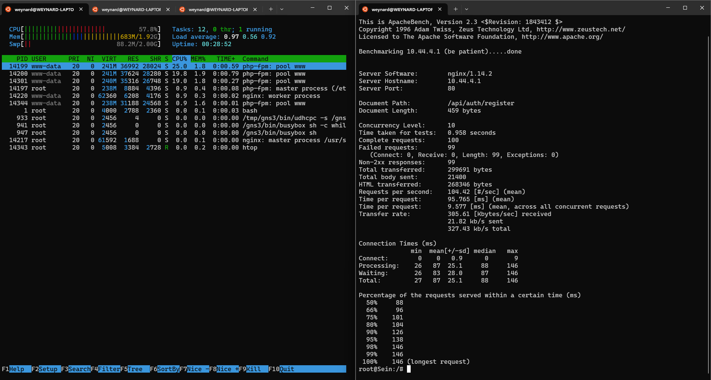

# Jarkom-Modul-3-E15-2023

<table>
    <tr>
        <th colspan=2> Kelompok E15 </th>
    </tr>
    <tr>
        <th>NRP</th>
        <th>Nama Anggota</th>
    </tr>
    <tr>
        <td>5025211014</td>
        <td>Alexander Weynard Samsico</td>
    </tr>
  <tr>
        <td>5025211121</td>
        <td>Frederick Yonatan Susanto</td>
    </tr>
</table>

## Topologi


## Config

### Aura (DHCP Relay)

```
auto eth0
iface eth0 inet dhcp

auto eth1
iface eth1 inet static
	address 10.44.1.9
	netmask 255.255.255.0

auto eth2
iface eth2 inet static
	address 10.44.2.9
	netmask 255.255.255.0

auto eth3
iface eth3 inet static
	address 10.44.3.9
	netmask 255.255.255.0

auto eth4
iface eth4 inet static
	address 10.44.4.9
	netmask 255.255.255.0
```

### Himmel (DHCP Server)

```
auto eth0
iface eth0 inet static
	address 10.44.1.1
	netmask 255.255.255.0
	gateway 10.44.1.9
```

### Heiter (DNS Server)

```
auto eth0
iface eth0 inet static
	address 10.44.1.2
	netmask 255.255.255.0
	gateway 10.44.1.9
```

### Denken (Database Server)

```
auto eth0
iface eth0 inet static
	address 10.44.2.1
	netmask 255.255.255.0
	gateway 10.44.2.9
```

### Eisen (Load Balancer)

```
auto eth0
iface eth0 inet static
	address 10.44.2.2
	netmask 255.255.255.0
	gateway 10.44.2.9
```

### Frieren (Laravel Worker)

```
auto eth0
iface eth0 inet dhcp
hwaddress ether ea:55:45:79:05:39
```

### Flamme (Laravel Worker)

```
auto eth0
iface eth0 inet dhcp
hwaddress ether 92:b0:a7:d3:41:24
```

### Fern (Laravel Worker)

```
auto eth0
iface eth0 inet dhcp
hwaddress ether 7e:a9:a1:90:cc:20
```

### Lawine (PHP Worker)

```
auto eth0
iface eth0 inet dhcp
hwaddress ether ce:12:90:c4:d1:89
```

### Linie (PHP Worker)

```
auto eth0
iface eth0 inet dhcp
hwaddress ether 12:8d:e0:8b:be:aba
```

### Lugner (PHP Worker)

```
auto eth0
iface eth0 inet dhcp
hwaddress ether a2:50:1c:66:1a:24
```

### Revolte, Richter, Sein, Stark (Client)

```
auto eth0
iface eth0 inet dhcp
```

## Setup

Pada .bashrc menggunakan nano :

### Heiter (DNS Server)

```
echo 'nameserver 192.168.122.1' > /etc/resolv.conf
apt-get update
apt-get install bind9 -y
```

### Himmel (DHCP Server)

```
echo 'nameserver 192.168.122.1' > /etc/resolv.conf   # Pastikan DNS Server sudah berjalan
apt-get update
apt install isc-dhcp-server -y
```

### Aura (DHCP Relay)

```
iptables -t nat -A POSTROUTING -o eth0 -j MASQUERADE -s 10.44.0.0/16
apt-get update
apt install isc-dhcp-relay -y
```

### Denken (Database Server)

```
echo 'nameserver 192.168.122.1' > /etc/resolv.conf
apt-get update
apt-get install mariadb-server -y

service mysql start
```

### Eisen (Load Balancer)

```
echo nameserver 192.168.122.1 > /etc/resolv.conf
apt-get update
apt-get install apache2-utils -y
apt-get install nginx php php-fpm -y
apt-get install htop -y
apt-get install lynx -y

service nginx start
```

### PHP Worker

```
echo nameserver 192.168.122.1 > /etc/resolv.conf
apt-get update
apt-get install nginx -y
service nginx restart
apt-get install lynx -y
apt-get install php php-fpm -y
service php7.3-fpm start
service php7.3-fpm status
apt-get install wget unzip -y
apt-get install htop -y

service nginx start
service php7.3-fpm start
```

### Laravel Worker

```
echo nameserver 192.168.122.1 > /etc/resolv.conf
rm etc/apt/sources.list.d/php.list
apt-get update
apt-get install mariadb-client -y
apt-get install htop -y
mariadb --host=10.44.2.1 --port=3306 --user=kelompokE15 --password
apt-get install lynx -y
apt-get install php8.0-mbstring php8.0-xml php8.0-cli   php8.0-common php8.0-intl php8.0-opcache php8.0-readline php8.0-mysql php8.0-fpm php8.0-curl unzip wget -y
apt-get install nginx -y

service nginx start
service php8.0-fpm start
```

## Soal 0

> kalian diminta untuk melakukan register domain berupa riegel.canyon.yyy.com untuk worker Laravel dan granz.channel.yyy.com untuk worker PHP (0) mengarah pada worker yang memiliki IP [prefix IP].x.1.

Untuk mendaftarkan domain riegel dan granz, kita perlu membuat konfigurasi pada DNS server agar IP Worker [prefix IP].x.1 dapat mengarah ke nama domain yang kita mau.

Pertama, kita update dan install dulu `bind9` pada Heiter (DNS Server)

```sh
echo "nameserver 192.168.122.1" > /etc/resolv.conf
apt-get update
apt-get install bind9 -y
```

Catatan: nameserver tersebut merupakan nameserver pada internet (NAT)

Kemudian, seperti pada modul sebelumnya, kita daftarkan domain riegel.canyon.E15.com dan granz.channel.E15.com pada `/etc/bind/named.conf.local` dengan tujuan untuk mengetahui arah pengaturan nama domain ini ada di mana.

```sh
echo '
zone "riegel.canyon.E15.com" {
        type master;
        file "/etc/bind/riegel/riegel.canyon.E15.com";
};

zone "granz.channel.E15.com" {
        type master;
        file "/etc/bind/granz/granz.channel.E15.com";
};
' > /etc/bind/named.conf.local
```

Setelah itu, kita membuat konfigurasinya pada file-file yang kita tujukan.

- **riegel.canyon.E15.com**

  ```sh
  mkdir /etc/bind/riegel/

  echo '
  ;
  ; BIND data file for local loopback interface
  ;
  $TTL    604800
  @       IN      SOA     riegel.canyon.E15.com. root.riegel.canyon.E15.com. (
                      2023111301         ; Serial
                          604800         ; Refresh
                          86400         ; Retry
                          2419200         ; Expire
                          604800 )       ; Negative Cache TTL
  ;
  @       IN      NS      riegel.canyon.E15.com.
  @       IN      A       10.44.4.1 ; IP Frieren
  www     IN      CNAME   riegel.canyon.E15.com.
  ' > /etc/bind/riegel/riegel.canyon.E15.com
  ```

  - Catatan: 10.44.4.1 merupakan IP Frieren, maka domain ini akan digunakan Frieren

- **granz.channel.E15.com**
  ```sh
  echo '
  ;
  ; BIND data file for local loopback interface
  ;
  $TTL    604800
  @       IN      SOA     granz.channel.E15.com. root.granz.channel.E15.com. (
                      2023111302         ; Serial
                          604800         ; Refresh
                          86400         ; Retry
                          2419200         ; Expire
                          604800 )       ; Negative Cache TTL
  ;
  @       IN      NS      granz.channel.E15.com.
  @       IN      A       10.44.3.1 ; IP Lawine
  www     IN      CNAME   granz.channel.E15.com.
  ' > /etc/bind/granz/granz.channel.E15.com
  ```
  - Catatan: 10.44.3.1 merupakan IP Lawine, maka domain ini akan digunakan Lawine

Sehingga domain-domain ini sudah siap digunakan. Langkah terakhir yang dapat kita lakukan adalah untuk forward alamat IP NAT `192.168.122.1` agar dapat akses juga untuk IP lainnya

```sh
echo 'options {
        directory "/var/cache/bind";

        forwarders {
                   192.168.122.1;
          };
        //dnssec-validation auto;
        allow-query{ any; };
        listen-on-v6 { any; };
};' > /etc/bind/named.conf.options
```

Terakhir, tidak lupa untuk melakukan restart pada bind

```sh
service bind9 restart
```

### Screenshot:


## Soal 1

> Lakukan konfigurasi sesuai dengan peta yang sudah diberikan.

Langkah pertama adalah menyiapkan konfigurasi topologi dan setup sesuai dengan petunjuk di atas. Selanjutnya, untuk keperluan pengujian, kita perlu menambahkan domain terdaftar, yaitu riegel.canyon.E15.com untuk worker Laravel dan granz.channel.E15.com untuk worker PHP yang mengarah ke worker dengan IP 10.44.x.1.

Selanjutnya pada DNS Server (Heiter), kita perlu menjalankan script di bawah ini:

```
echo "nameserver 192.168.122.1" > /etc/resolv.conf
apt-get update
apt-get install bind9 -y

echo '
zone "riegel.canyon.E15.com" {
        type master;
        file "/etc/bind/riegel/riegel.canyon.E15.com";
};

zone "granz.channel.E15.com" {
        type master;
        file "/etc/bind/granz/granz.channel.E15.com";
};
' > /etc/bind/named.conf.local

mkdir /etc/bind/riegel/

echo '
;
; BIND data file for local loopback interface
;
$TTL    604800
@       IN      SOA     riegel.canyon.E15.com. root.riegel.canyon.E15.com. (
                     2023111301         ; Serial
                         604800         ; Refresh
                          86400         ; Retry
                        2419200         ; Expire
                         604800 )       ; Negative Cache TTL
;
@       IN      NS      riegel.canyon.E15.com.
@       IN      A       10.44.4.1 ; IP Frieren
www     IN      CNAME   riegel.canyon.E15.com.
' > /etc/bind/riegel/riegel.canyon.E15.com

mkdir /etc/bind/granz/

echo '
;
; BIND data file for local loopback interface
;
$TTL    604800
@       IN      SOA     granz.channel.E15.com. root.granz.channel.E15.com. (
                     2023111302         ; Serial
                         604800         ; Refresh
                          86400         ; Retry
                        2419200         ; Expire
                         604800 )       ; Negative Cache TTL
;
@       IN      NS      granz.channel.E15.com.
@       IN      A       10.44.3.1 ; IP Lawine
www     IN      CNAME   granz.channel.E15.com.
' > /etc/bind/granz/granz.channel.E15.com

echo 'options {
        directory "/var/cache/bind";

        forwarders {
                   192.168.122.1;
          };
        //dnssec-validation auto;
        allow-query{ any; };
        listen-on-v6 { any; };
};' > /etc/bind/named.conf.options

service bind9 restart
```

### Screenshot:


## Soal 2

> Client yang melalui Switch3 mendapatkan range IP dari [prefix IP].3.16 - [prefix IP].3.32 dan [prefix IP].3.64 - [prefix IP].3.80

Sebelum memulai pekerjaan, penting untuk mengatur DHCP Server terlebih dahulu. Selanjutnya, jalankan perintah berikut di DHCP Server:

```
echo "subnet 10.44.1.0 netmask 255.255.255.0 {
}

subnet 10.44.2.0 netmask 255.255.255.0 {
}

subnet 10.44.3.0 netmask 255.255.255.0 {
        range 10.44.3.16 10.44.3.32;
        range 10.44.3.64 10.44.3.80;
        option routers 10.44.3.9;
}
```

## Soal 3

> Client yang melalui Switch4 mendapatkan range IP dari [prefix IP].4.12 - [prefix IP].4.20 dan [prefix IP].4.160 - [prefix IP].4.168

Berikutnya, kita harus menambahkan beberapa konfigurasi baru untuk switch4 dengan menjalankan perintah berikut:

```
subnet 10.44.4.0 netmask 255.255.255.0 {
        range 10.44.4.12 10.44.4.20;
        range 10.44.4.160 10.44.4.168;
        option routers 10.44.4.9;
}
```

## Soal 4

> Client mendapatkan DNS dari Heiter dan dapat terhubung dengan internet melalui DNS tersebut

Akan kita tambahkan beberapa konfigurasi seperti option broadcast-address dan option domain-name-server agar DNS yang telah disiapkan sebelumnya dapat digunakan.

```
echo "subnet 10.44.1.0 netmask 255.255.255.0 {
}

subnet 10.44.2.0 netmask 255.255.255.0 {
}

subnet 10.44.3.0 netmask 255.255.255.0 {
        range 10.44.3.16 10.44.3.32;
        range 10.44.3.64 10.44.3.80;
        option routers 10.44.3.9;
        option broadcast-address 10.44.3.255;
        option domain-name-servers 10.44.1.2;
}

subnet 10.44.4.0 netmask 255.255.255.0 {
        range 10.44.4.12 10.44.4.20;
        range 10.44.4.160 10.44.4.168;
        option routers 10.44.4.9;
        option broadcast-address 10.44.4.255;
        option domain-name-servers 10.44.1.2;
}
```

Sebelum melanjutkan, kita perlu menyiapkan konfigurasi untuk DHCP Relay terlebih dahulu. Selanjutnya, jalankan perintah berikut di DHCP Relay:

```
iptables -t nat -A POSTROUTING -o eth0 -j MASQUERADE -s 10.44.0.0/16


apt-get update
apt-get install isc-dhcp-relay -y
service isc-dhcp-relay start

echo 'SERVERS="10.44.1.1"
INTERFACES="eth1 eth2 eth3 eth4"
OPTIONS=""' > /etc/default/isc-dhcp-relay

echo 'net.ipv4.ip_forward=1' > /etc/sysctl.conf

service isc-dhcp-relay restart
```

### Screenshot:


## Soal 5

> Lama waktu DHCP server meminjamkan alamat IP kepada Client yang melalui Switch3 selama 3 menit sedangkan pada client yang melalui Switch4 selama 12 menit. Dengan waktu maksimal dialokasikan untuk peminjaman alamat IP selama 96 menit

Agar sesuai dengan aturan yang telah ditentukan, kita akan menggunakan fungsi default-lease-time dan max-lease-team, dengan satuan dalam detik. Untuk Switch3, waktu peminjaman IP adalah 180 detik (3 menit), untuk Switch4 adalah 720 detik (12 menit), dan max-lease-time adalah 5760 detik (96 menit).

Selanjutnya, kita perlu menambahkan beberapa konfigurasi baru untuk mengatur leasing time pada switch3 dan switch4. Berikut adalah perintah yang dapat dijalankan pada DHCP Server:

```
echo "subnet 10.44.1.0 netmask 255.255.255.0 {
}

subnet 10.44.2.0 netmask 255.255.255.0 {
}

subnet 10.44.3.0 netmask 255.255.255.0 {
        range 10.44.3.16 10.44.3.32;
        range 10.44.3.64 10.44.3.80;
        option routers 10.44.3.9;
        option broadcast-address 10.44.3.255;
        option domain-name-servers 10.44.1.2;
        default-lease-time 180;
        max-lease-time 5760;

}

subnet 10.44.4.0 netmask 255.255.255.0 {
        range 10.44.4.12 10.44.4.20;
        range 10.44.4.160 10.44.4.168;
        option routers 10.44.4.9;
        option broadcast-address 10.44.4.255;
        option domain-name-servers 10.44.1.2;
        default-lease-time 720;
        max-lease-time 5760;
}
" > /etc/dhcp/dhcpd.conf

rm /var/run/dhcpd.pid

service isc-dhcp-server restart
```

### Screenshot:


## Soal 6

> Pada masing-masing worker PHP, lakukan konfigurasi virtual host untuk website berikut dengan menggunakan php 7.3. (6)

Pada soal ini, kita diminta untuk melakukan konfigurasi host nginx pada worker PHP yaitu Lawine, Linie, Lugner. Pertama kita lakukan koneksi pada nameserver `192.168.122.1` untuk mendapatkan internet NAT dan lakukan penginstallan nginx.

```sh
apt-get update && apt-get install nginx -y
service nginx restart
```

Tidak lupa juga untuk sekaligus melakukan restart nginx

Kemudian, kita akan melakukan penginstalan php-fpm versi 7.3

```sh
apt-get install php php-fpm -y
service php7.3-fpm start
service php7.3-fpm status
```

Penjelasan:

- melakukan penginstallan `php php-fpm`
- melakukan start pada `php7.3-fpm`
- mengecek status untuk `php7.3-fpm`

Berikutnya, kami mendownload zip `granz.channel.yyy.com.zip` dengan menggunakan wget melalui github kami sendiri dan melakukan unzip

```sh
apt-get install wget unzip -y

wget https://github.com/weynard02/jarkom-modul3-resources/archive/refs/heads/main.zip

unzip main.zip
```

Setelah itu, melakukan konfigurasi worker pada `/etc/nginx/sites-available/granz` dengan isi sebagai berikut

```sh
echo '
server {

        listen 80;

        root /var/www/granz;

        index index.php index.html index.htm;
        server_name _;

        location / {
                        try_files $uri $uri/ /index.php?$query_string;
        }

        # pass PHP scripts to FastCGI server
        location ~ \.php$ {
                include snippets/fastcgi-php.conf;
                fastcgi_pass unix:/var/run/php/php7.3-fpm.sock;
        }
        location ~ /\.ht {
                        deny all;
        }

        error_log /var/log/nginx/granz_error.log;
        access_log /var/log/nginx/granz_access.log;
 } ' > /etc/nginx/sites-available/granz
```

Penjelasan:

- Menggunakan port default: 80
- website akan dieksekusi dari /var/www/granz
- `fastcgi_pass` yang digunakan adalah php7.3-fpm

Berikutnya membuat symlink pada `sites-enabled`

```sh
ln -s /etc/nginx/sites-available/granz /etc/nginx/sites-enabled
```

Kemudian kita memindahkan website `granz.channel.yyy.com` yang kita download pada lokasi `/var/www/granz`

```sh
mkdir var/www/granz

mv jarkom-modul3-resources-main/granz.channel.E15.com/modul-3/* var/www/granz/
```

Remove page nginx defaultnya untuk masing-masing worker

```sh
rm -rf /etc/nginx/sites-enabled/default
```

Terakhir, kita dapat menjalankan restart php7.3-fpm dan nginx

```sh
service php7.3-fpm restart
service nginx restart
```

Langkah-langkah berlaku untuk masing-masing worker PHP dan dapat siap untuk digunakan. Untuk melakukan testing dapat menggunakan `lynx` untuk mengakses ip worker tersebut

```sh
apt-get install lynx -y
```

### Screenshot:

- lynx 10.44.3.1 #IP Lawine
  

- lynx 10.44.3.2 #IP Linie
  

- lynx 10.44.3.3 #IP Lugner
  

## Soal 7

> Kepala suku dari Bredt Region memberikan resource server sebagai berikut:
> Lawine, 4GB, 2vCPU, dan 80 GB SSD.
> Linie, 2GB, 2vCPU, dan 50 GB SSD.
> Lugner 1GB, 1vCPU, dan 25 GB SSD.
> aturlah agar Eisen dapat bekerja dengan maksimal, lalu lakukan testing dengan 1000 request dan 100 request/second. (7)

Pada soal ini kita diminta untuk membuat server yang dapat menghandle worker-worker PHP yaitu dengan menggunakan Load Balancer Eisen dan kemudian melakukan testing dengan 1000 requests dan 100 requests/second.

Sebelum itu, kita akan melakukan instalasi persiapan pada Eisen terlebih dahulu

```sh
apt-get update && apt-get install apache2-utils -y
apt-get install nginx php php-fpm -y
apt-get install htop -y
apt-get install lynx -y
```

Penjelasan:

- `apache2-utils` untuk melakukan testing benchmark requests
- `nginx php php-fpm` untuk konfigurasi load balancer
- `htop` sebagai monitor resources
- `lynx` sebagai penguji IP site

Diketahui bahwa spesifikasi tiap worker sebagai berikut

```
- Lawine, 4GB, 2vCPU, dan 80 GB SSD.
- Linie, 2GB, 2vCPU, dan 50 GB SSD.
- Lugner 1GB, 1vCPU, dan 25 GB SSD.
```

Semakin besar angka spesifikasi tersebut, semakin kuat worker tersebut dan pastinya semakin terprioritas. Oleh karena itu, kita dapat mengakali dengan menggunakan algoritma Weighted Robin Round pada Load Balancer yang di mana server yang memiliki weight paling besar akan dijadikan prioritas ketika menerima request dari client. Weight juga akan memastikan bahwa server yang lebih kuat memiliki beban yang lebih besar. Konfigurasi load balancing pada Eisen sebagai berikut

```sh
echo '
upstream backend  {
        server 10.44.3.1 weight=640; #IP Lawine
        server 10.44.3.2 weight=200; #IP Linie
        server 10.44.3.3 weight=25; #IP Lugner
}

server {
        listen 80;
        server_name granz.channel.E15.com www.granz.channel.E15.com;

        location / {
                proxy_pass http://backend;
                proxy_set_header    X-Real-IP $remote_addr;
                proxy_set_header    X-Forwarded-For $proxy_add_x_forwarded_for;
                proxy_set_header    Host $http_host;

        }
        error_log /var/log/nginx/lb_error.log;
        access_log /var/log/nginx/lb_access.log;

}' > /etc/nginx/sites-available/lb-eisen
```

Penjelasan:

- Weight ini dihitung melalui hasil perkalian
  - Lawine 4x2x80 = 640
  - Linie 2x2x50 = 200
  - Lugner 1x1x25 = 25
- menggunakan listen port default=80
- menggunakan server name `granz.channel.E15.com www.granz.channel.E15.com`
- konfigurasi ini dinamakan `lb-eisen` pada `/etc/nginx/sites-available/lb-eisen`

Kemudian, membuat symlink pada sites-enabled dan melakukan restart nginx

```sh
ln -s /etc/nginx/sites-available/lb-eisen /etc/nginx/sites-enabled
service nginx restart
```

Untuk melakukan testing, kita akan menggunakan Apache Benchmark dengan 1000 requests dan 100 requests per second.

```sh
mkdir /root/benchmark
cd /root/benchmark
ab -n 1000 -c 100 -g out.data http://10.44.2.2/
cd /
```

Penjelasan:

- Di sini kami membuat folder benchmark sebagai tempat hasil data testing yang diperoleh.
- `-n` merupakan argumen jumlah requests
- `-c` merupakan argumen konkurensi (requests/second)
- `-g` merupakan argumen untuk mengirimkan data pada `out.data`
- URL yang digunakan adalah IP dari Load Balancer Eisen
- Hasil testing tersebut berada di /root/benchmark/out.data

### Screenshot:

#### lynx 10.44.2.2 # IP Load Balancer


#### Testing

ab


out.data


## Soal 8

> Karena diminta untuk menuliskan grimoire, buatlah analisis hasil testing dengan 200 request dan 10 request/second masing-masing algoritma Load Balancer dengan ketentuan sebagai berikut:
> Nama Algoritma Load Balancer
> Report hasil testing pada Apache Benchmark
> Grafik request per second untuk masing masing algoritma.
> Analisis

Sebaiknya, lakukan setup terlebih dahulu sebelum memulai pekerjaan. Setelah itu, untuk konfigurasinya, kita dapat mengikuti langkah-langkah pada Soal 7. Untuk laporan Grimoire, kita meletakkannya di Google Docs pada link https://docs.google.com/document/d/1Gh81IxXaY_SFNiubnodrvTH90uhHpoHjjTT7lGO7NyI/edit?usp=sharing.

Terdapat 5 algoritma yang dipakai untuk nomor 8 ini yaitu, roundrobin, weighted roundrobin, least connection, ip hash, dan generic hash.

Dengan script berikut:

**roundrobin.sh**

```
#Default menggunakan Round Robin
echo '
upstream backend  {
        server 10.44.3.1; #IP Lawine
        server 10.44.3.2; #IP Linie
        server 10.44.3.3; #IP Lugner
}

server {
listen 80;
server_name granz.channel.E15.com;

        location / {
                proxy_pass http://backend;
                proxy_set_header    X-Real-IP $remote_addr;
                proxy_set_header    X-Forwarded-For $proxy_add_x_forwarded_for;
                proxy_set_header    Host $http_host;
        }

error_log /var/log/nginx/lb_error.log;
access_log /var/log/nginx/lb_access.log;

}
' > /etc/nginx/sites-available/lb-eisen

service nginx restart

#ab -n 200 -c 10 http://10.44.2.2/
```

**weightedroundrobin.sh**

```
echo '
upstream backend  {
        server 10.44.3.1 weight=640; #IP Lawine
        server 10.44.3.2 weight=200; #IP Linie
        server 10.44.3.3 weight=25; #IP Lugner
}

server {
listen 80;
server_name granz.channel.E15.com;

        location / {
                proxy_pass http://backend;
                proxy_set_header    X-Real-IP $remote_addr;
                proxy_set_header    X-Forwarded-For $proxy_add_x_forwarded_for;
                proxy_set_header    Host $http_host;
        }

error_log /var/log/nginx/lb_error.log;
access_log /var/log/nginx/lb_access.log;

}
' > /etc/nginx/sites-available/lb-eisen

service nginx restart

#ab -n 200 -c 10 http://10.44.2.2/
```

**leastconnection.sh**

```
echo '
upstream backend  {
        least_conn;
        server 10.44.3.1; #IP Lawine
        server 10.44.3.2; #IP Linie
        server 10.44.3.3; #IP Lugner
}

server {
listen 80;
server_name granz.channel.E15.com;

        location / {
                proxy_pass http://backend;
                proxy_set_header    X-Real-IP $remote_addr;
                proxy_set_header    X-Forwarded-For $proxy_add_x_forwarded_for;
                proxy_set_header    Host $http_host;
        }

error_log /var/log/nginx/lb_error.log;
access_log /var/log/nginx/lb_access.log;

}
' > /etc/nginx/sites-available/lb-eisen

service nginx restart

#ab -n 200 -c 10 http://10.44.2.2/
```

**iphash.sh**

```
echo '
upstream backend  {
        ip_hash;
        server 10.44.3.1; #IP Lawine
        server 10.44.3.2; #IP Linie
        server 10.44.3.3; #IP Lugner
}

server {
listen 80;
server_name granz.channel.E15.com;

        location / {
                proxy_pass http://backend;
                proxy_set_header    X-Real-IP $remote_addr;
                proxy_set_header    X-Forwarded-For $proxy_add_x_forwarded_for;
                proxy_set_header    Host $http_host;
        }

error_log /var/log/nginx/lb_error.log;
access_log /var/log/nginx/lb_access.log;

}
' > /etc/nginx/sites-available/lb-eisen

service nginx restart

#ab -n 200 -c 10 http://10.44.2.2/
```

**generichash.sh**

```
echo '
upstream backend  {
        hash $request_uri consistent;
        server 10.44.3.1; #IP Lawine
        server 10.44.3.2; #IP Linie
        server 10.44.3.3; #IP Lugner
}

server {
listen 80;
server_name granz.channel.E15.com;

        location / {
                proxy_pass http://backend;
                proxy_set_header    X-Real-IP $remote_addr;
                proxy_set_header    X-Forwarded-For $proxy_add_x_forwarded_for;
                proxy_set_header    Host $http_host;
        }

error_log /var/log/nginx/lb_error.log;
access_log /var/log/nginx/lb_access.log;

}
' > /etc/nginx/sites-available/lb-eisen

service nginx restart

#ab -n 200 -c 10 http://10.44.2.2/
```

**Testing di client**

```
ab -n 200 -c 10 http://10.44.2.2/
```

**Menampilkan htop pada worker**

```
htop
```

### Screenshot:


## Soal 9

> Dengan menggunakan algoritma Round Robin, lakukan testing dengan menggunakan 3 worker, 2 worker, dan 1 worker sebanyak 100 request dengan 10 request/second, kemudian tambahkan grafiknya pada grimoire.

Sebelum melangkah lebih jauh, pastikan untuk menyelesaikan setup terlebih dahulu. Setelah selesai setup pada node Eisen, sekarang saatnya melakukan pengujian pada load balancer yang telah dibuat sebelumnya. Perbedaannya terletak pada pengujian menggunakan 1 worker, 2 worker, dan 3 worker.

**Roundrobin 1 worker**

```
#Default menggunakan Round Robin
echo '
upstream backend  {
        server 10.44.3.1; #IP Lawine
}

server {
listen 80;
server_name granz.channel.E15.com;

        location / {
                proxy_pass http://backend;
                proxy_set_header    X-Real-IP $remote_addr;
                proxy_set_header    X-Forwarded-For $proxy_add_x_forwarded_for;
                proxy_set_header    Host $http_host;
        }

error_log /var/log/nginx/lb_error.log;
access_log /var/log/nginx/lb_access.log;

}
' > /etc/nginx/sites-available/lb-eisen

service nginx restart

#ab -n 200 -c 10 http://10.44.2.2/
```

**Roundrobin 2 worker**

```
#Default menggunakan Round Robin
echo '
upstream backend  {
        server 10.44.3.1; #IP Lawine
        server 10.44.3.2; #IP Linie
}

server {
listen 80;
server_name granz.channel.E15.com;

        location / {
                proxy_pass http://backend;
                proxy_set_header    X-Real-IP $remote_addr;
                proxy_set_header    X-Forwarded-For $proxy_add_x_forwarded_for;
                proxy_set_header    Host $http_host;
        }

error_log /var/log/nginx/lb_error.log;
access_log /var/log/nginx/lb_access.log;

}
' > /etc/nginx/sites-available/lb-eisen

service nginx restart

#ab -n 200 -c 10 http://10.44.2.2/
```

**Roundrobin 3 worker**

```
#Default menggunakan Round Robin
echo '
upstream backend  {
        server 10.44.3.1; #IP Lawine
        server 10.44.3.2; #IP Linie
        server 10.44.3.3; #IP Lugner
}

server {
listen 80;
server_name granz.channel.E15.com;

        location / {
                proxy_pass http://backend;
                proxy_set_header    X-Real-IP $remote_addr;
                proxy_set_header    X-Forwarded-For $proxy_add_x_forwarded_for;
                proxy_set_header    Host $http_host;
        }

error_log /var/log/nginx/lb_error.log;
access_log /var/log/nginx/lb_access.log;

}
' > /etc/nginx/sites-available/lb-eisen

service nginx restart

#ab -n 200 -c 10 http://10.44.2.2/
```

**Testing di client**

```
ab -n 200 -c 10 http://10.44.2.2/
```

### Screenshot:


## Soal 10

> Selanjutnya coba tambahkan konfigurasi autentikasi di LB dengan dengan kombinasi username: “netics” dan password: “ajkyyy”, dengan yyy merupakan kode kelompok. Terakhir simpan file “htpasswd” nya di /etc/nginx/rahasisakita/

Tambahkan code berikut pada Eisen (Load Balancer) :

```
mkdir /etc/nginx/rahasisakita
touch /etc/nginx/rahasisakita/.htpasswd
htpasswd -b -c /etc/nginx/rahasisakita/.htpasswd netics ajkE15
```

**Keterangan :**
username : netics
password : ajkE15

Setelah memasukkan username dan password, sekarang coba tambahkan perintah berikut pada setup Nginx:

```
auth_basic "Administrators Area";
auth_basic_user_file /etc/nginx/rahasisakita/.htpasswd;
```

### Screenshot:


## Soal 11

> Lalu buat untuk setiap request yang mengandung /its akan di proxy passing menuju halaman https://www.its.ac.id.

Lakukan konfigurasi tambahan pada nginx sebagai berikut:

```
location /its {
	proxy_pass https://www.its.ac.id;
}
```

Maksudnya adalah ketika kita melakukan akses pada endpoint yang mengandung /its akan diarahkan oleh proxy_pass menuju https://www.its.ac.id. Jadi ketika melakukan testing pada client dengan menggunakan perintah berikut:

```
lynx http://10.44.2.2/its
```

### Screenshot:


## Soal 12

> Selanjutnya LB ini hanya boleh diakses oleh client dengan IP [Prefix IP].3.69, [Prefix IP].3.70, [Prefix IP].4.167, dan [Prefix IP].4.168.

Lakukan konfigurasi tambahan pada nginx sebagai berikut:

```
allow 10.44.3.69;
                allow 10.44.3.70;
                allow 10.44.4.167;
                allow 10.44.4.168;
                deny all;
```

**IP Deny**

### Screenshot:


**IP Allow**

Cara untuk testingnya:

Karena IP yang diberikan random, sekarang kami akan melakukan tambahan allow pada IP 10.44.4.14 pada konfigurasi sebelumnya, karena ip client yang mau di test yaitu 10.44.4.14.


## Soal 13

> Karena para petualang kehabisan uang, mereka kembali bekerja untuk mengatur riegel.canyon.yyy.com. Semua data yang diperlukan, diatur pada Denken dan harus dapat diakses oleh Frieren, Flamme, dan Fern. (13)

a. Denken (Database Server)

Denken merupakan Database Server yang di mana akan mengurus data pada aplikasi Laravel nanti. Untuk merealisasikan hal tersebut, kita dapat menginstall **MariaDB server** beserta **mysql** sebagai bahan database server untuk Denken.

```sh
apt-get update
apt-get install mariadb-server -y
service mysql start
```

Dengan mysql yang sudah distart, maka mariadb server ini bisa digunakan. Kita perlu untuk mendaftar username dan password untuk mariaDB mysql ini.

```sh
echo "
CREATE USER 'kelompokE15'@'%' IDENTIFIED BY 'passwordE15';
CREATE USER 'kelompokE15'@'localhost' IDENTIFIED BY 'passwordE15';
CREATE DATABASE dbkelompokE15;
GRANT ALL PRIVILEGES ON *.* TO 'kelompokE15'@'%';
GRANT ALL PRIVILEGES ON *.* TO 'kelompokE15'@'localhost';
FLUSH PRIVILEGES;
" > init.sql
```

Penjelasan:

- `CREATE USER` digunakan untuk membuat user dengan (IDENTIFIED BY) password yang diberikan. Di kasus ini, kami membuat user "kelompokE15" dengan @ bebas dan "localhost" dengan password "passwordE15".
- `CREARE DATABASE` digunakan untuk membuat suatu database yang akan kita gunakan. Di sini kami memberi nama "dbkelompokE15"
- `GRANT ALL PRIVILEGES` digunakan untuk memberikan hak-hak semua _privileges_ pada user yang kita punya.
- `FLUSH PRIVILEGES` digunakan untuk mereload privileges yang ada
- Perintah-perintah sql ini dimasukan pada `init.sql`

kemudian kita masukan file perintah-perintah mysql itu ke dalam mariaDB server mysql dengan menggunakan username `root` yang tanpa sebuah password/

```sh
mysql -u root < init.sql
```

Catatan: -u merupakan argumen username

Database ini akan digunakan oleh 3 worker Laravel. Oleh karena itu, kita tambahkan konfigurasi ini pada `/etc/mysql/my.cnf`.

```sh
echo '
# The MariaDB configuration file
#
# The MariaDB/MySQL tools read configuration files in the following order:
# 1. "/etc/mysql/mariadb.cnf" (this file) to set global defaults,
# 2. "/etc/mysql/conf.d/*.cnf" to set global options.
# 3. "/etc/mysql/mariadb.conf.d/*.cnf" to set MariaDB-only options.
# 4. "~/.my.cnf" to set user-specific options.
#
# If the same option is defined multiple times, the last one will apply.
#
# One can use all long options that the program supports.
# Run program with --help to get a list of available options and with
# --print-defaults to see which it would actually understand and use.
#
# This group is read both both by the client and the server
# use it for options that affect everything
#
[client-server]

# Import all .cnf files from configuration directory
!includedir /etc/mysql/conf.d/
!includedir /etc/mysql/mariadb.conf.d/

[mysqld]
skip-networking=0
skip-bind-address
' > /etc/mysql/my.cnf
```

Kemudian jangan lupa untuk melakukan restart pada mysqlnya

```sh
service mysql restart
```

b. Frieren, Flamme, dan Fern (Database Client)

Agar para client bisa mengakses data dari denken, kita cukup melakukan koneksi pada MariaDB tersebut dengan hanya menginstall MariaDB versi client.

```sh
apt-get update
apt-get install mariadb-client -y
```

Setelah kita menginstall package di atas, berikutnya kita hanya mencoba melakukan koneksi MariaDB dengan host dari Denken dengan menggunakan perintah berikut:

```sh
mariadb --host=10.44.2.1 --port=3306 --user=kelompokE15 --password
```

Penjelasan:

- `--host` merupakan pemilihan server database yang akan digunakan. Untuk kasus ini IP Denken yang akan digunakan sebagai server
- `--port` merupakan port yang digunakan (default = 3306)
- `--user` merupakan username yang akan digunakan
- `--password` memberitahu jika kita akan menginputkan password

Setelah itu, akan diminta untuk menginput password seperti yang kami atur pada server sebelumnya "passwordE15".

Jika berhasil, maka akan tampak CLI untuk MariaDB.

### Screenshot:

MariaDB Server (Denken)


MariaDB Client (Worker Laravel)


## Soal 14

> Frieren, Flamme, dan Fern memiliki Riegel Channel sesuai dengan quest guide berikut. Jangan lupa melakukan instalasi PHP8.0 dan Composer (14)

Untuk masing-masing worker, kita diminta untuk membangun konfigurasi Riegel Canyon dengan instalasi PHP8.0 dan Composer.

Mari kita melakukan instalasi PHP8.0 dahulu pada masing-masing worker: Frieren, Flamme, dan Fern.

```sh
apt-get update

# Install package untuk menambahkan repository PHP
apt-get install -y lsb-release ca-certificates apt-transport-https software-properties-common gnupg2

# Download GPG-key untuk PHP
curl -sSLo /usr/share/keyrings/deb.sury.org-php.gpg https://packages.sury.org/php/apt.gpg

# Tambahkan entri repositori baru untuk paket PHP Ondrej Sury ke worker
sh -c 'echo "deb [signed-by=/usr/share/keyrings/deb.sury.org-php.gpg] https://packages.sury.org/php/ $(lsb_release -sc) main" > /etc/apt/sources.list.d/php.list'

# Lakukan update lagi
apt-get update

# Install package PHP versi 8.0
apt-get install php8.0-mbstring php8.0-xml php8.0-cli php8.0-common php8.0-intl php8.0-opcache php8.0-readline php8.0-mysql php8.0-fpm php8.0-curl unzip wget -y

# Pengecekan apakah php sudah terinstall
php --version
```

Instalasi php 8.0 sudah selesai. Kemudian kita menginstall nginx untuk config worker nanti

```c
apt-get install nginx -y
```

Setelah itu, kita menginstall composer cukup dengan mendownload composer dari `getcomposer.org` dan melakukan pemindahan ke usr/bin

```sh
wget https://getcomposer.org/download/2.0.13/composer.phar
chmod +x composer.phar
mv composer.phar /usr/bin/composer

# Pengecekan versi Composer
composer -V
```

Composer sudah berhasil terinstall pada worker. Selanjutnya, kita akan melakukan git clone dari **quest guide** tersebut yaitu aplikasi Laravel.

```sh
# Melakukan instalasi git terlebih dahulu
apt-get install git -y

# git clone untuk mendapatkan Laravel Projectnya
git clone https://github.com/martuafernando/laravel-praktikum-jarkom.git
```

Kemudian kita mengakses ke dalam projectnya dan melakukan `composer update` dan `composer install` untuk menginstall libraries atau dependencies yang dibutuhkan

Setelah itu, kita membuat .env nya dengan cara melakukan copy dari .env.example
`cp .env.example .env`

dan lakukan perubahan pada bagian databasenya mulai dari host, port, nama database, username, dan passwordnya

```sh
DB_CONNECTION=mysql
DB_HOST=10.44.2.1
DB_PORT=3306
DB_DATABASE=dbkelompokE15
DB_USERNAME=kelompokE15
DB_PASSWORD=passwordE15
```

Penjelasan:

- `DB_HOST` merupakan host IP Denken (Database Server)
- `DB_DATABASE, DB_USERNAME, DB_PASSWORD` sesuai dengan pengaturan sebelumnya

Masih di dalam project tersebut, kita jalankan perintah ini pada salah satu worker saja

```sh
php artisan migrate:fresh
php artisan db:seed --class=AiringsTableSeeder
```

Penjelasan:

- `php artisan migrate:fresh` merupakan perintah untuk melakukan migrasi pada tabel-tabel database seperti kolom, tipe data, dan lain-lain sesuai migration dari project Laravel
- `php artisan db:seed --class=AiringsTableSeeder` merupakan pengisian data pada Airings Table

Lakukan generation key dan jwt pada project Laravel

```sh
php artisan key:generate
php artisan jwt:secret
```

Penjelasan:

- `php artisan jwt:secret` dilakukan karena project menggunakan authentikasi JWT untuk membuat secret keynya

Konfigurasi project Laravel sudah selesai. Selanjutnyam kita melakukan konfigurasi nginx

```sh
echo '
server {

    listen 80;

    root /var/www/laravel-praktikum-jarkom/public;

    index index.php index.html index.htm;
    server_name _;

    location / {
            try_files $uri $uri/ /index.php?$query_string;
    }

    # pass PHP scripts to FastCGI server
    location ~ \.php$ {
        include snippets/fastcgi-php.conf;
        fastcgi_pass unix:/var/run/php/php8.0-fpm.sock;
    }

location ~ /\.ht {
            deny all;
    }

    error_log /var/log/nginx/riegel_error.log;
    access_log /var/log/nginx/riegel_access.log;
}
' > /etc/nginx/sites-available/riegel
ln -s /etc/nginx/sites-available/riegel /etc/nginx/sites-enabled/
mv /laravel-praktikum-jarkom /var/www
```

Penjelasan:

- Menggunakan port worker default = 80
- Menggunakan root `/var/www/laravel-praktikum-jarkom/public`
- fastcgi yang digunakan adalah php versi 8.0
- `ln -s /etc/nginx/sites-available/riegel /etc/nginx/sites-enabled/` untuk symlink
- `mv /laravel-praktikum-jarkom /var/www` memindahkan project Laravel pada dalam folder /var/www

Kemudian, kita memberikan server web www-data izin untuk menggunakan direktori penyimpanan

```sh
chown -R www-data.www-data /var/www/laravel-praktikum-jarkom/storage
```

Tidak lupa juga untuk menghapus page nginx default

```sh
rm -rf /etc/nginx/sites-enabled/default
```

Terakhir, kita menjalankan `php8.0-fpm` dan `nginx`

```sh
service php8.0-fpm start
service nginx restart
```

Kemudian kita membuat Load Balancer pada Eisen sebagai Riegel Canyon untuk worker-worker Laravel dengan konfigurasi `lb-laravel` sebagai berikut:

```sh
echo '
upstream laravel {
        server 10.44.4.1;
        server 10.44.4.2;
        server 10.44.4.3;
}

server {
        listen 88;
        server_name riegel.canyon.E15.com www.riegel.canyon.E15.com;

        location / {
                proxy_pass http://laravel;
        }
}
' > /etc/nginx/sites-available/lb-laravel
```

Penjelasan:

- mengaitkan server dari IP Frieren, Flamme, dan Fren.
- `listen` menggunakan port 88 karena default 80 sudah digunakan pada load balancer PHP workers
- tersimpan pada `/etc/nginx/sites-available/lb-laravel`
  Lakukan symlink dan restart nginx pada Eisen.

Untuk pengujian, kita dapat melakukan lynx pada masing-masing IP Worker Laravel

```sh
apt-get install lynx -y
lynx 10.44.4.1 # IP Frieren
lynx 10.44.4.2 # IP Flamme
lynx 10.44.4.3 # IP Fern
lynx 10.44.2.2:88 # IP LB
```

### Screenshot:

Hasil:

- lynx 10.44.4.1 # IP Frieren


- lynx 10.44.4.2 # IP Flamme


- lynx 10.44.4.3 # IP Fern


- lynx 10.44.2.2:88 # IP LB
  

## Soal 15

> Riegel Channel memiliki beberapa endpoint yang harus ditesting sebanyak 100 request dengan 10 request/second. Tambahkan response dan hasil testing pada grimoire.
> POST /auth/register (15)

Untuk soal ini dan sampai dengan soal 17, kita perlu melakukan testing pada client (kasus kali ini kami menggunakan Sein) dengan salah satu worker saja. Pada /auth/register, kita perlu suatu request untuk bisa mengakses pada url tersebut. Untuk melakukan Apache Benchmark, kita perlu menyiapkan request dalam data.json.

```sh
echo '
{
    "username": "kelompokE15",
    "password": "passwordE15"
}
' > data.json
```

Kita dapat melakukan **testing** terlebih dahulu dengan 100 requests dan 10 requests/second pada worker Frieren.

```sh
ab -n 100 -c 10 -p data.json -T application/json http://10.44.4.1/api/auth/register
```

Penjelasan:

- `-n` merupakan argumen jumlah requests
- `-c` merupakan argumen konkurensi (requests/second)
- `-p` merupakan argumen POST untuk suatu `data.json`
- `-T` merupakan type applicationnya yaitu `application/json`
- URLnya merupakan IP Frieren `/api/auth/register`

### Screenshot:



Penjelasan: di sini, ada 99 failed requests, karena pada tabel users, username bersifat unik (hanya 1)

```
$table->string('username')->unique(); // dari migration user
```

Untuk mendapatkan **response**nya kita dapat menggunakan perintah curl, ada 2 jawaban kemungkinan yang didapat antara karena data user sudah diinputkan atau belum

```sh
curl -X POST -H "Content-Type: application/json" -d '{"username": "kelompokE15","password": "passwordE15"}' http://10.44.4.1/api/auth/register
```

Penjelasan:

- `-X POST` merupakan jenisnya yaitu metode POST
- `-H` merupakan header yang menyatakan bahwa `Content-Type: application/json`
- `-d` merupakan data requestnya

### Screenshot:

Jika data request sudah diregister sebelumnya


Jika memasukkan data request yang baru


## Soal 16

> POST /auth/login (16)

Pada /auth/login ini, kita akan menggunakan data.json sebelumnya bahan untuk melakukan login pada API.

Untuk **testing** sebagai berikut

```sh
ab -n 100 -c 10 -p data.json -T application/json http://10.44.4.1/api/auth/login
```

Penjelasan:

- `-n` merupakan argumen jumlah requests
- `-c` merupakan argumen konkurensi (requests/second)
- `-p` merupakan argumen POST untuk suatu `data.json`
- `-T` merupakan type applicationnya yaitu `application/json`
- URLnya merupakan IP Frieren `/api/auth/login`

### Screenshot:


Penjelasan: Di sini dilihat bahwa ada sebanyak 39 requests yang gagal dan CPU workernya mencapai 100%. Hal ini membuktikan bahwa 1 worker tidak kuat untuk memproses 100 requests dalam 10 requests/second.

Untuk mendapatkan **response**, kita akan menggunakan perintah curl

```sh
curl -X POST -H "Content-Type: application/json" -d '{"username": "kelompokE15","password": "passwordE15"}' http://10.44.4.1/api/auth/login
```

Penjelasan:

- `-X POST` merupakan jenisnya yaitu metode POST
- `-H` merupakan header yang menyatakan bahwa `Content-Type: application/json`
- `-d` merupakan data requestnya

### Screenshot:


Penjelasan: **Response** yang diterima adalah sebuah token, yang di mana akan berguna untuk authentikasi dan authorisasi nantinya.

## Soal 17

> GET /me (17)

`/me` memerlukan authentikasi / authorisasi. Di sinilah kita akan menggunakan token yang baru saja kita dapatkan. Sebelum itu, kita dapat memindahkan token di atas pada suatu txt. Oleh karena itu, kita perlu install suatu package untuk menangani bentuk json

```sh
apt-get install jq -y
```

Kemudian kita ambil token dari curl sebelumnya dengan menggunakan jq yang akan mengfilter token aslinya pada `login.txt`

```sh
curl -X POST -H "Content-Type: application/json" -d '{"username": "kelompokE15","password": "passwordE15"}' http://10.44.4.1/api/auth/login | jq -r '.token' > login.txt
```

### Screenshot:


token sudah tersimpan pada login.txt. Selanjutnya kita akan menguji **response** yang didapatkan melalui curl.

```sh
token=$(cat login.txt) | curl -X GET -H "Content-Type: application/json" -H "Authorization: Bearer $token" http://10.44.4.1/api/me
```

Penjelasan:

- token akan diambil dari login.txt sebagai variabel
- `-X GET` merupakan jenisnya yaitu metode GET
- `-H` merupakan header yang menyatakan bahwa `Content-Type: application/json` dan akan menggunakan Authorization berjenis Bearer dengan `$token`

### Screenshot:


Penjelasan: di sini kita dapat **response** berupa data diri kita.

Kemudian untuk **testing** sebagai berikut:

```sh
token=$(cat login.txt) | ab -n 100 -c 10 -H "Authorization: Bearer $token" http://10.44.4.1/api/me
```

Penjelasan:

- token akan diambil dari login.txt sebagai variabel
- `-n` merupakan argumen jumlah requests
- `-c` merupakan argumen konkurensi (requests/second)
- `-H` merupakan header yang menyatakan bahwa `Content-Type: application/json` dan akan menggunakan Authorization berjenis Bearer dengan `$token`
- URLnya merupakan IP Frieren `/api/me`

### Screenshot:


Penjelasan: di sini 100 requests dapat dilalui dengan lancar

## Soal 18

> Untuk memastikan ketiganya bekerja sama secara adil untuk mengatur Riegel Channel maka implementasikan Proxy Bind pada Eisen untuk mengaitkan IP dari Frieren, Flamme, dan Fern. (18)

Agar dapat mengaitkan IP dari Frieren, Flamme, dan Fren. Kita membutuhkan load balancer dari Eisen. Kita akan membuatkan konfigurasi load balancer yang baru untuk worker-worker laravel dengan mengimplementasikan Proxy Bind.

```sh
echo '
upstream laravel {
        server 10.44.4.1;
        server 10.44.4.2;
        server 10.44.4.3;
}

server {
        listen 88;
        server_name riegel.canyon.E15.com www.riegel.canyon.E15.com;

        location / {
                proxy_pass http://laravel;
        }

        location /frieren/ {
                proxy_bind 10.44.2.2;
                proxy_pass http://10.44.4.1/;
        }

        location /flamme/ {
                proxy_bind 10.44.2.2;
                proxy_pass http://10.44.4.2/;
        }

        location /fern/ {
                proxy_bind 10.44.2.2;
                proxy_pass http://10.44.4.3/;
        }


}

' > /etc/nginx/sites-available/lb-laravel


ln -s /etc/nginx/sites-available/lb-laravel /etc/nginx/sites-enabled
service nginx restart
```

Penjelasan:

- mengaitkan server dari IP Frieren, Flamme, dan Fren.
- `listen` menggunakan port 88 karena default 80 sudah digunakan pada load balancer PHP workers
- `proxy_bind` digunakan pada lokasi belakang Frieren, Flamme, dan Fren, yang di mana masing-masing mengarah ke IP Eisen (Load Balancer) dengan proxy_pass yang mengarah ke masing-masing IP Laravel Worker
- Konfigurasi akan tersimpan pada `/etc/nginx/sites-available/lb-laravel`
- dibuat symlink pada sites-enabled
- kemudian tidak lupa untuk melakukan restart nginx

### Screenshot:

Untuk pengujian hasil:

- lynx 10.44.2.2:88 # IP LB


- lynx 10.44.2.2:88/frieren


- lynx 10.44.2.2:88/flamme


- lynx 10.44.2.2:88/fern


## Soal 19

> Untuk meningkatkan performa dari Worker, coba implementasikan PHP-FPM pada Frieren, Flamme, dan Fern. Untuk testing kinerja naikkan
>
> - pm.max_children
> - pm.start_servers
> - pm.min_spare_servers
> - pm.max_spare_servers

> sebanyak tiga percobaan dan lakukan testing sebanyak 100 request dengan 10 request/second kemudian berikan hasil analisisnya pada Grimoire.(19)

Variabel-variabel yang disebutkan dapat ditemukan pada worker yang menggunakan PHP-FPM di `/etc/php/8.0/fpm/pool.d/www.conf`.

Berikut penjelasan untuk masing-masing variabel

- `pm.max_children` merupakan jumlah maksimum proses child yang dapat dibuat oleh PHP-FPM. Jumlah ini disesuaikan dengan kapasitas server sehingga tidak melebihi sumber daya
- `pm.start_servers` merupakan jumlah proses child yang dibuat saat pertama kali dijalankan
- `pm.min_spare_servers` merupakan jumlah minimum proses child yang harus tetap aktif saat server berjalan sehingga dapat siap menangani permintaan tanpa perlu dibuat ulang.
- `pm.max_spare_servers` merupakan jumlah maksimum proses child yang tetap aktif pada suatu waktu.

Untuk menguji performa untuk masing-masing worker ada 4 konfigurasi (1 default + 3 proses naikkan) yang akan digunakan

- Default

```
pm.max_children = 5
pm.start_servers = 2
pm.min_spare_servers = 1
pm.max_spare_servers = 3
```

- Naik 1

```
pm.max_children = 20
pm.start_servers = 5
pm.min_spare_servers = 2
pm.max_spare_servers = 6
```

- Naik 2

```
pm.max_children = 50
pm.start_servers = 10
pm.min_spare_servers = 5
pm.max_spare_servers = 15
```

- Naik 3

```
pm.max_children = 100
pm.start_servers = 15
pm.min_spare_servers = 10
pm.max_spare_servers = 20
```

Untuk masing-masing konfigurasi yang akan digunakan, bisa langsung menggantikan variabel-variabel menjadi yang di atas pada `/etc/php/8.0/fpm/pool.d/www.conf`

Setiap kali ada perubahan file tersebut, jangan lupa untuk melakukan php-fpm restart dan nginx restart

```sh
/etc/init.d/php8.0-fpm restart
service nginx restart
```

Untuk memastikan di Eisen, dapat dilakukan nginx restart

Untuk melakukan testing, kami akan menggunakan command

```sh
ab -n 100 -c 10 -p data.json -T application/json http://10.44.2.2:88/api/auth/login
```

Penjelasan: Di mana 10.44.2.2:88 merupakan ip dan port untuk load balancer laravel pada client Sein. ada 100 requests dan 10 requests/second.

### Screenshot:

- Konfigurasi Default:
  

- Konfigurasi Naik 1:
  

- Konfigurasi Naik 2:
  

- Konfigurasi Naik 3:
  

#### Kesimpulan:

Berdasarkan hasil analisis yang diberikan, dengan konfigurasi PHP-FPM, dapat meningkatkan performa seperti time taken for tests dan requests per second. Akan tetapi, tidak ada jaminan bahwa hasil yang didapatkan selalu lebih baik dari yang lain karena ada percobaan hanya dilakukan sekali, beberapa percobaan yang tidak membuktikan bahwa meningkatkan PHP-FPM dapat performa yang lebih baik, dan ada faktor lain seperti kekuatan server, load balancer, atau worker

## Soal 20

> Nampaknya hanya menggunakan PHP-FPM tidak cukup untuk meningkatkan performa dari worker maka implementasikan Least-Conn pada Eisen. Untuk testing kinerja dari worker tersebut dilakukan sebanyak 100 request dengan 10 request/second.

Untuk soal ini, kita cukup mengimplementasikan Least-conn pada Load Balancer Laravel pada Eisen menjadi sebagai berikut:

```sh
echo '
upstream laravel {
        least_conn;
        server 10.44.4.1;
        server 10.44.4.2;
        server 10.44.4.3;
}

server {
        listen 88;
        server_name riegel.canyon.E15.com www.riegel.canyon.E15.com;

        location / {
                proxy_pass http://laravel;
        }

        location /frieren/ {
                proxy_bind 10.44.2.2;
                proxy_pass http://10.44.4.1/;
        }

        location /flamme/ {
                proxy_bind 10.44.2.2;
                proxy_pass http://10.44.4.2/;
        }

        location /fern/ {
                proxy_bind 10.44.2.2;
                proxy_pass http://10.44.4.3/;
        }


}

' > /etc/nginx/sites-available/lb-laravel
```

Tidak lupa juga untuk melakukan restart nginx

Untuk testing ini, kita akan mencoba dengan command sebelumnya

```sh
ab -n 100 -c 10 -p data.json -T application/json http://10.44.2.2:88/api/auth/login
```

dengan konfigurasi PHP-FPM Naik 3

### Screenshot:


#### Kesimpulan:

Dapat dilihat bahwa dengan menggunakan least_conn, didapatkan time taken for tests lebih cepat, requests per second yang lebih besar, longest request yang lebih rendah, dan CPU yang lebih rendah daripada menggunakan round robin

---

## Kendala:

- Setiap kali DHCP direload akan memunculkan error bahwa pid dari dhcp sudah ada. Solusinya hanya melakukan penghapusan:

  ```sh
  rm /var/run/dhcpd.pid
  ```

- Setiap kali worker Laravel direload akan memunculkan error bahwa php.list sudah ada. Solusinya hanya melakukan penghapusan pada php.list tersebut:

  ```sh
  rm etc/apt/sources.list.d/php.list
  ```

- Sempat kebingungan cara untuk melakukan ab dengan request. Solusinya adalah membuat data.json terlebih dahulu
